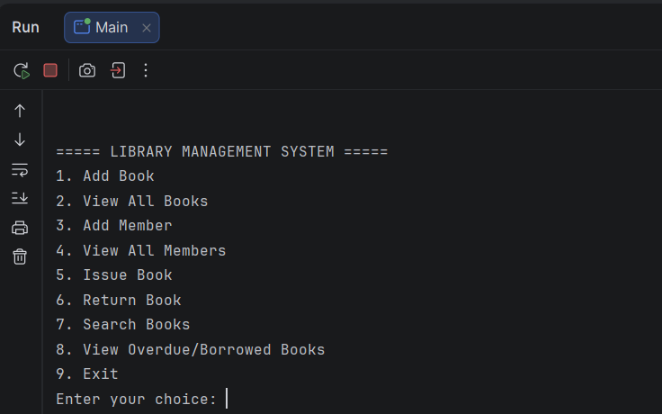
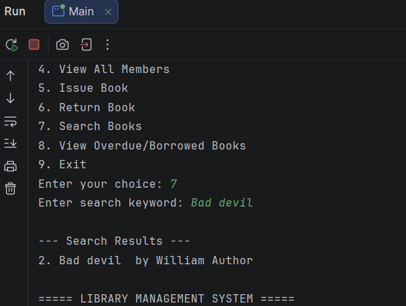
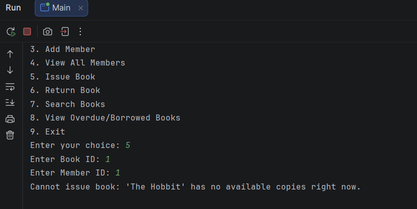

# Library Management System

A terminal-based Java application for managing a library's book catalog, member registrations, and book borrowing/returning activity. Built as a course project applying core OOP principles, the Java Collections Framework, and JDBC database connectivity.

## Features

- Add, view, and search books by title or author
- Add and view library members
- Issue books to members, with automatic prevention of issuing books with zero available copies
- Return books
- View a report of currently borrowed and overdue books
- Input validation on all numeric menu choices
- Data persists permanently in a SQLite database between program runs

## Technologies Used

- Java 17+ (JDK)
- JDBC with the SQLite JDBC driver (v3.53.4.0)
- SQLite database (no server setup required)

## Database Setup

The application automatically creates all required tables on first run. The schema is also provided separately in schema.sql for reference:

```
CREATE TABLE books (
    id INTEGER PRIMARY KEY AUTOINCREMENT,
    title TEXT NOT NULL,
    author TEXT NOT NULL,
    isbn TEXT UNIQUE,
    category TEXT,
    total_copies INTEGER,
    available_copies INTEGER
);

CREATE TABLE members (
    id INTEGER PRIMARY KEY AUTOINCREMENT,
    name TEXT NOT NULL,
    email TEXT,
    phone TEXT
);

CREATE TABLE borrow_records (
    id INTEGER PRIMARY KEY AUTOINCREMENT,
    book_id INTEGER,
    member_id INTEGER,
    borrow_date TEXT,
    due_date TEXT,
    return_date TEXT,
    FOREIGN KEY (book_id) REFERENCES books(id),
    FOREIGN KEY (member_id) REFERENCES members(id)
);
```


 ## Setup and Run Instructions

1. Clone this repository:
```bash
   git clone https://github.com/bikashshah056-rgb/library-management-system.git
```
2. Open the project in IntelliJ IDEA (or any Java IDE).
3. Ensure the sqlite-jdbc-3.53.4.0.jar file in the lib folder is added as a project library (File - Project Structure - Libraries).
4. Run src/main/Main.java. The database file (library.db) and all tables will be created automatically on first run.

## Screenshots

### Main Menu


### Search Books


### Exception Handling

